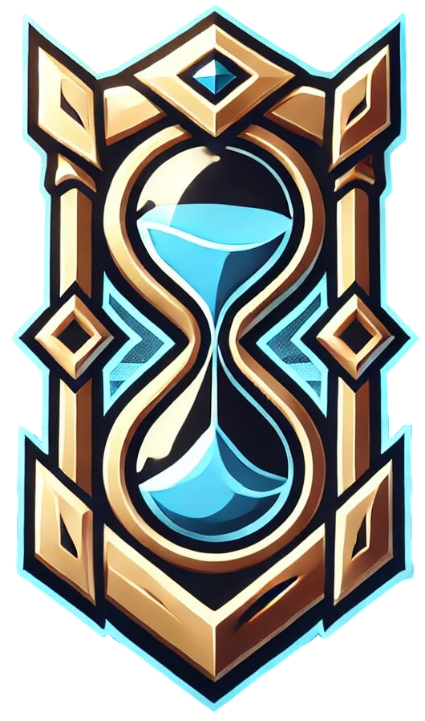

[![Contributors][contributors-shield]][contributors-url]
[![Stargazers][stars-shield]][stars-url]
[![Issues][issues-shield]][issues-url]



# ZhonyaS

> **League of Legends Player Scouting Platform** - Scout players like a pro before tournaments, scrims, or Clash

[](https://www.python.org/)
[](https://nextjs.org/)
[](https://flask.palletsprojects.com/)
[](https://www.docker.com/)
[](https://mariadb.org/)
[](https://developer.riotgames.com/)

## 🎯 Overview

**ZhonyaS** is a comprehensive League of Legends player scouting platform that helps teams and coaches analyze player performance before important matches. Using Riot Games' API, it fetches detailed game history from 2023 to present and provides actionable insights for competitive play.


## ✨ Features

### 🔍 Player Analysis
- **Comprehensive Game History**: Retrieve player data from 2023 to present
- **Detailed Statistics**: KDA, CS, gold, damage, and more
- **Champion Pool Analysis**: Track performance across different champions
- **Match Timeline**: Analyze game progression and key moments

### 👥 Team Management
- **Team Creation**: Create and manage multiple teams
- **Player Roles**: Assign specific roles (Top, Jungle, Mid, ADC, Support)
- **Player Search**: Find and add players to teams
- **Team Analytics**: Compare team compositions and strategies

### 🔐 User Management
- **Authentication System**: Secure login/register with JWT
- **Password Recovery**: Email-based password reset
- **User Profiles**: Manage personal information and preferences

### 🎨 Modern UI/UX
- **Next.js Frontend**: Fast, responsive React application
- **Tailwind CSS**: Modern, utility-first styling
- **Shadcn/ui**: Beautiful, accessible components
- **Dark/Light Mode**: Theme switching support
- **Real-time Updates**: Socket.io integration for live data

## 🚀 Tech Stack

### Backend
- **Python 3.11+** with Flask
- **MariaDB** database
- **JWT** authentication
- **Socket.io** for real-time communication
- **Riot Games API** integration

### Frontend
- **Next.js 15.5+** with React 19
- **TypeScript** for type safety
- **Tailwind CSS** for styling
- **Shadcn/ui** component library
- **Axios** for API calls

### DevOps
- **Docker** containerization
- **Docker Compose** for orchestration
- **Environment-based** configuration

## 📦 Installation

### Prerequisites
- Python 3.11+
- Node.js 18+
- Docker & Docker Compose
- Riot Games API Key

### Quick Start

1. **Clone the repository**
```bash
git clone https://github.com/YuToutCourt/ZhonyaS.git
cd ZhonyaS
```

2. **Set up environment variables**
```bash
cp env.example .env
# Edit .env with your configuration
```

3. **Start with Docker**
```bash
docker-compose -f docker-compose.dev.yml up -d
```

4. **Initialize database**
```bash
# Run the SQL script in setup/create_database.sql
# Or use your preferred MariaDB client
```

5. **Start the application**
```bash
# Backend
cd backend
python app.py

# Frontend (in another terminal)
cd frontend
npm install
npm run dev
```

6. **Access the application**
- Frontend: http://localhost:3000
- Backend API: http://localhost:5000

## 🔧 Configuration

### Environment Variables

Create a `.env` file based on `env.example`:

```env
# Riot Games API
API_KEY=your_riot_api_key_here

# Database
USER_DB=zhonyas
PASSWORD_DB=your_password
DATABASE_NAME=zhonyas

# JWT Secret
SECRET_KEY=your_secret_key_here

# Email Configuration
SMTP_SERVER=smtp.gmail.com
SMTP_PORT=587
EMAIL_USER=your_email@gmail.com
EMAIL_PASSWORD=your_app_password
```

## 📋 TODO List

## 🐛 Known Issues

### Database Issues
- **SQL Error 1020**: "Record has changed since last read in table 'Player'" - Occurs when multiple connections try to modify the same table simultaneously. Each connection should have its own cursor.

### Player Management
- **Username Update Bug**: When a player changes their username/tag, the database updates correctly with the new pseudo/tag, but the search remains stuck on the old pseudo/tag.

### AI Coach Issues
- **Blue Side Ban Logic**: The AI is incorrectly banning for the player instead of against them when on blue side.

### UI/UX Issues
- **Download Progress**: When downloading games in the teams section, the frontend doesn't update the progress bar. Consider removing the modal for better user experience.

- [ ] Refactor the codebase for better maintainability (using MVC pattern) (P1)
- [ ] Docker of the backend, frontend and database (P1)
- [x] Bug Fixing (P1) - See [Known Issues](#-known-issues) section
- [ ] Pentest of the application (P2)
- [ ] Real logo not IA made (P2)
- [ ] Better email template (P2)
- [ ] Add OAuth integration (P4)

## 🤝 Contributing

We welcome contributions! Please see our [Contributing Guidelines](CONTRIBUTING.md) for details.

### Development Setup
1. Fork the repository
2. Create a feature branch
3. Make your changes
4. Add tests if applicable
5. Submit a pull request


## 🙏 Acknowledgments

- [Riot Games](https://developer.riotgames.com/) for the amazing API
- [Next.js](https://nextjs.org/) team for the excellent framework
- [Shadcn/ui](https://ui.shadcn.com/) for beautiful components
- All contributors and testers

---

**⚠️ Note**: This project is currently in development. Some features may be incomplete or subject to change.

**💡 Looking for contributors**: We're especially looking for frontend developers to help improve the UI/UX!

[contributors-shield]: https://img.shields.io/github/contributors/YuToutCourt/ZhonyaS?style=for-the-badge
[contributors-url]: https://github.com/YuToutCourt/ZhonyaS/graphs/contributors
[stars-shield]: https://img.shields.io/github/stars/YuToutCourt/ZhonyaS.svg?style=for-the-badge
[stars-url]: https://github.com/YuToutCourt/ZhonyaS/stargazers
[issues-shield]: https://img.shields.io/github/issues/YuToutCourt/ZhonyaS.svg?style=for-the-badge
[issues-url]: https://github.com/YuToutCourt/ZhonyaS/issues