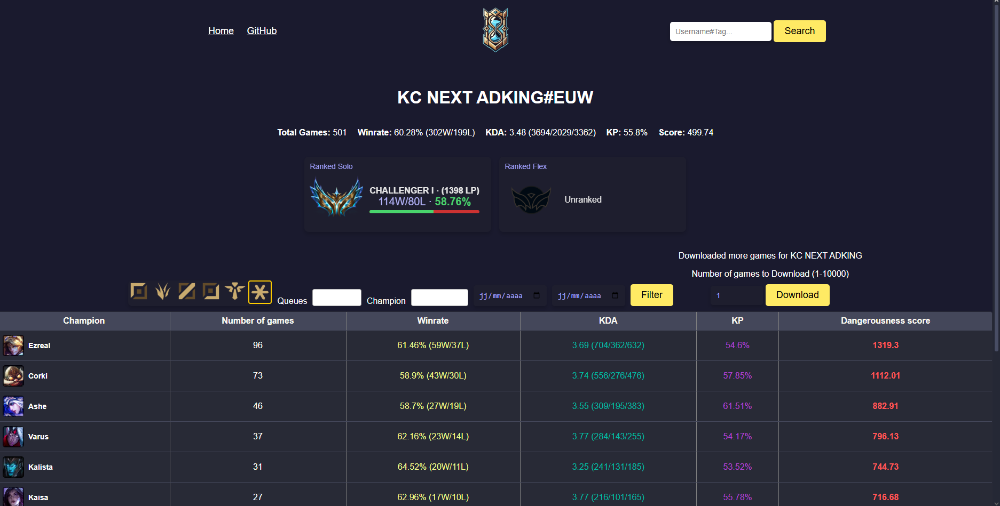

[![Contributors][contributors-shield]][contributors-url]
[![Stargazers][stars-shield]][stars-url]
[![Issues][issues-shield]][issues-url]


# ZhonyaS

⚠️ Looking for a frontend dev to make it look better ⚠️

[](https://www.python.org/)
[](https://flask.palletsprojects.com/)
[](https://www.docker.com/)
[](https://mariadb.org/)
[](https://developer.riotgames.com/)


## Introduction

Are you looking for an efficient tool to scout a player's performance before a scrim, tournament, or Clash?

**ZhonyaS** is here to help. Using Riot Games' API, it fetches a player’s game history from June 2021 to the present and provides a comprehensive summary of their performance.




⚠️ *Currently for personal use only. Not a SaaS-ready application yet.* ⚠️

## Features

- Retrieve a player's game history from the Riot Games API.
- Display detailed statistics and match summaries.
- Easy-to-use interface for scouting players before tournaments or scrims.

## Installation 

Follow these steps to set up **ZhonyaS** on your local machine:
1. Clone the repository:
```bash
git clone https://github.com/YuToutCourt/ZhonyaS-Flask.git
cd ZhonyaS
pip install -r ./setup/requirements.txt
```
2. Set up your Docker environment:
```bash
# Set up your Docker environment:
docker-compose up -d
```

3. Create the tables with the sql script 

    Create the necessary tables using the provided SQL script:

⚠️ Make sure to replace the `.env` data with your personal values (Riot API keys, database credentials, etc.). ⚠️

## Usage

```bash
python3 app.py
# And then goto this url : http://127.0.0.1:5000
```

## Upcoming features
- Improved UI/UX design.
- Riot API production integration for more requests.
- Enhanced error handling and notifications.

## TODO
- Refactor the codebase for better maintainability.
- Improve application performance.

----

Feel free to give your opinion about the application and on what it can be improved

[contributors-shield]: https://img.shields.io/github/contributors/YuToutCourt/ZhonyaS?style=for-the-badge
[contributors-url]: https://github.com/YuToutCourt/ZhonyaS/graphs/contributors
[stars-shield]: https://img.shields.io/github/stars/YuToutCourt/ZhonyaS.svg?style=for-the-badge
[stars-url]: https://github.com/YuToutCourt/ZhonyaS/stargazers
[issues-shield]: https://img.shields.io/github/issues/YuToutCourt/ZhonyaS.svg?style=for-the-badge
[issues-url]: https://github.com/YuToutCourt/ZhonyaS/issues